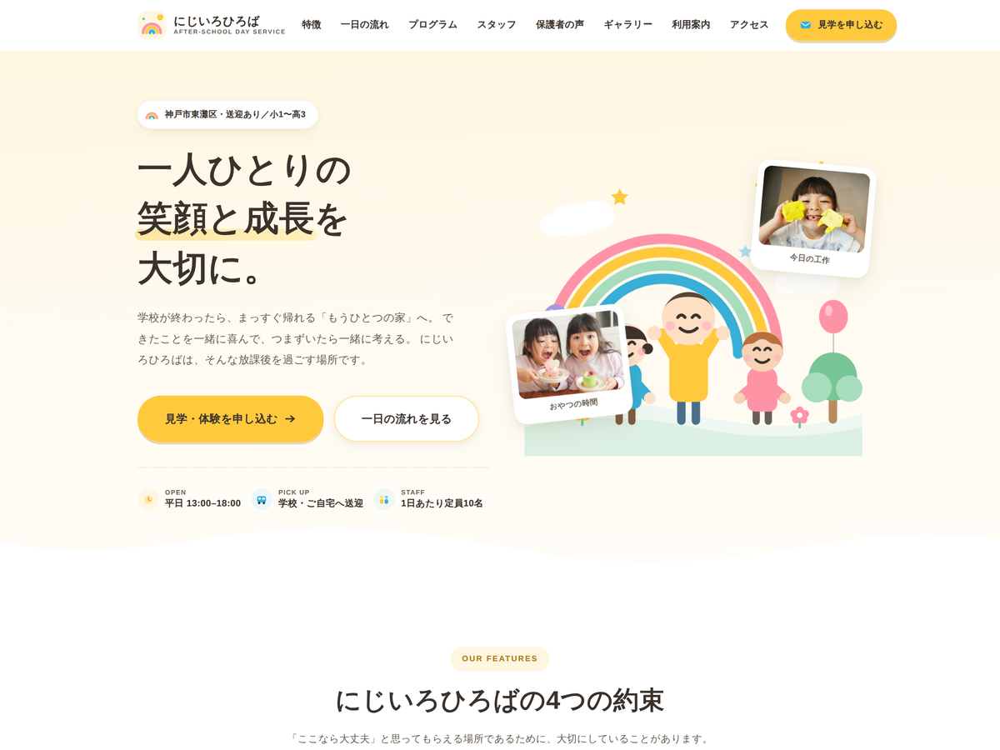

# にじいろひろば — WordPress オリジナルテーマ

放課後等デイサービス「にじいろひろば」のためにゼロから制作した WordPress テーマです。
配布テーマやテーマビルダーは使用せず、テンプレートファイルと PHP をすべて自分で記述しています。

静的な HTML / CSS で先にサイトを完成させたあと、WordPress テーマへ移植しました。

> **注記**
> にじいろひろばは架空の施設です。サイト内の施設名・住所・電話番号・スタッフ名・
> お知らせの内容はすべて架空のもので、実在する施設とは関係ありません。
> 掲載写真はフリー素材を使用しています。



## 実装している機能

| 機能 | 内容 |
| --- | --- |
| カスタム投稿タイプ | `news`（お知らせ）を `register_post_type()` で登録。管理画面に専用メニューを追加 |
| カスタムタクソノミー | `news_cat`（お知らせカテゴリー）。「イベント」「重要なお知らせ」などを管理画面で作成 |
| アイキャッチ画像 | `add_theme_support( 'post-thumbnails' )`。個別ページの先頭に表示 |
| 一覧のページ送り | `the_posts_pagination()` |
| 前後の記事へのリンク | `previous_post_link()` / `next_post_link()` |
| ナビゲーションメニュー | `register_nav_menus()` でメインとフッターの2か所を登録 |
| アセットの読み込み | `wp_enqueue_style()` / `wp_enqueue_script()` |
| レスポンシブ対応 | CSS のみ。ハンバーガーメニューは素の JavaScript |

## ファイル構成

```
nijiiro-hiroba/
├── style.css           テーマ情報のコメント + サイト全体のスタイル
├── functions.php       テーマ設定・カスタム投稿タイプ・アセット読み込み
├── header.php          ロゴ / ナビ / SVGアイコンスプライト（全ページ共通）
├── footer.php          フッター（全ページ共通）
├── front-page.php      トップページ。お知らせ最新3件を WP_Query で出力
├── archive-news.php    お知らせ一覧（ページ送りつき）
├── single-news.php     お知らせの個別ページ
├── index.php           上記に当てはまらない場合の受け皿
├── screenshot.png      テーマ一覧に表示されるサムネイル
├── js/
│   └── main.js         ヘッダーの影・ハンバーガーメニュー
└── images/             サイトで使用する写真
```

## 動作環境

- WordPress 6.0 以上
- PHP 7.4 以上

開発は [Local](https://localwp.com/)（PHP 8.2 / MySQL 8.4 / nginx）で行いました。

## インストール

1. このリポジトリをダウンロード、またはクローンします。

   ```bash
   git clone https://github.com/helpmark-pink/nijiiro-hiroba-theme.git
   ```

2. フォルダごと `wp-content/themes/` に配置します。
3. 管理画面の **外観 → テーマ** から「にじいろひろば」を有効化します。
4. **設定 → パーマリンク** を開き、そのまま「変更を保存」を押します。
   （カスタム投稿タイプの URL を有効にするために必要です）

## お知らせの追加方法

1. 管理画面の左メニュー **お知らせ → 新規追加**
2. タイトルと本文を入力
3. 必要に応じて、右側でお知らせカテゴリーとアイキャッチ画像を設定
4. 公開

トップページには新しいものから3件が表示され、`/news/` に一覧、
`/news/{スラッグ}/` に個別ページが自動で生成されます。

## 制作について

- 担当範囲: 企画 / デザイン / コーディング / テーマ実装
- 使用言語: HTML, CSS, JavaScript, PHP
- 使用ツール: WordPress, Local, VS Code, Figma

管理画面のキャプチャやテンプレート構成、つまずいた点の解決までを含めた制作過程は、
ポートフォリオサイトのケーススタディページにまとめています。

## ライセンス

GNU General Public License v2 or later — [LICENSE](LICENSE)
